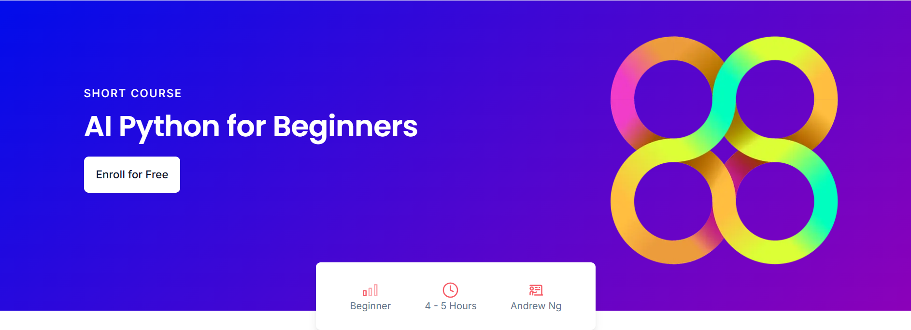

# Microsoft course AI-Python-for-Beginners -> changed to use local LLM
# source:   https://vscodeedu.com/courses/intro-to-python

# Introduction

This repository contains all the ipynb files, supporting files, and personal solutions to the corresponding exercises in the course.